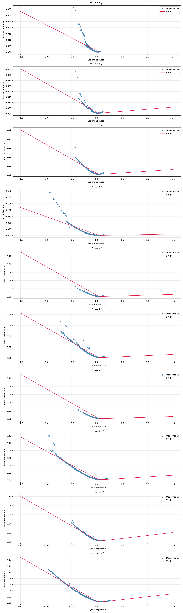
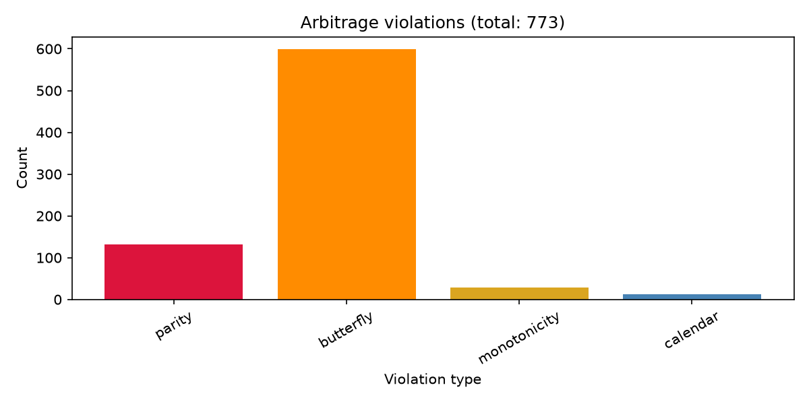
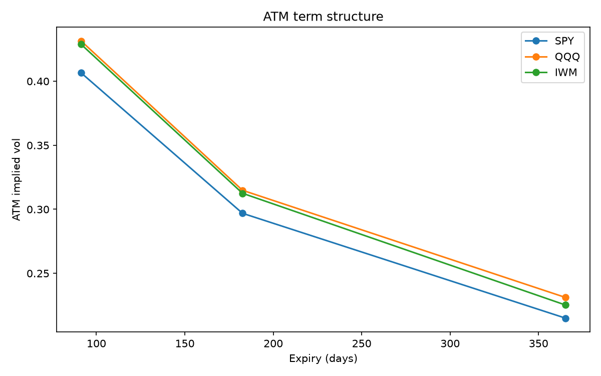
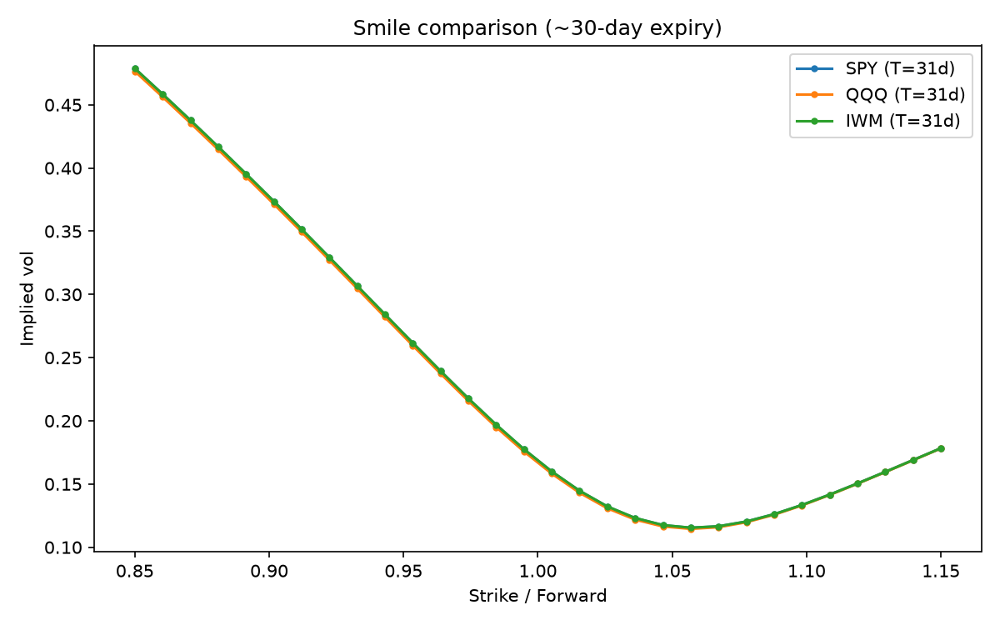
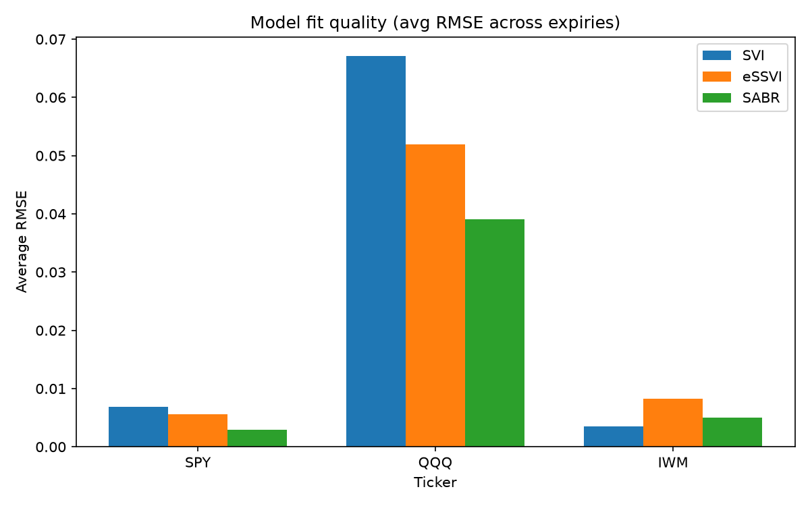
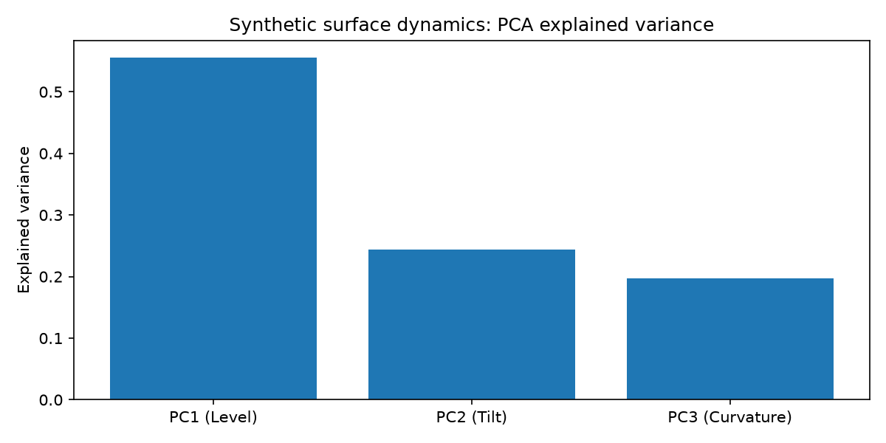
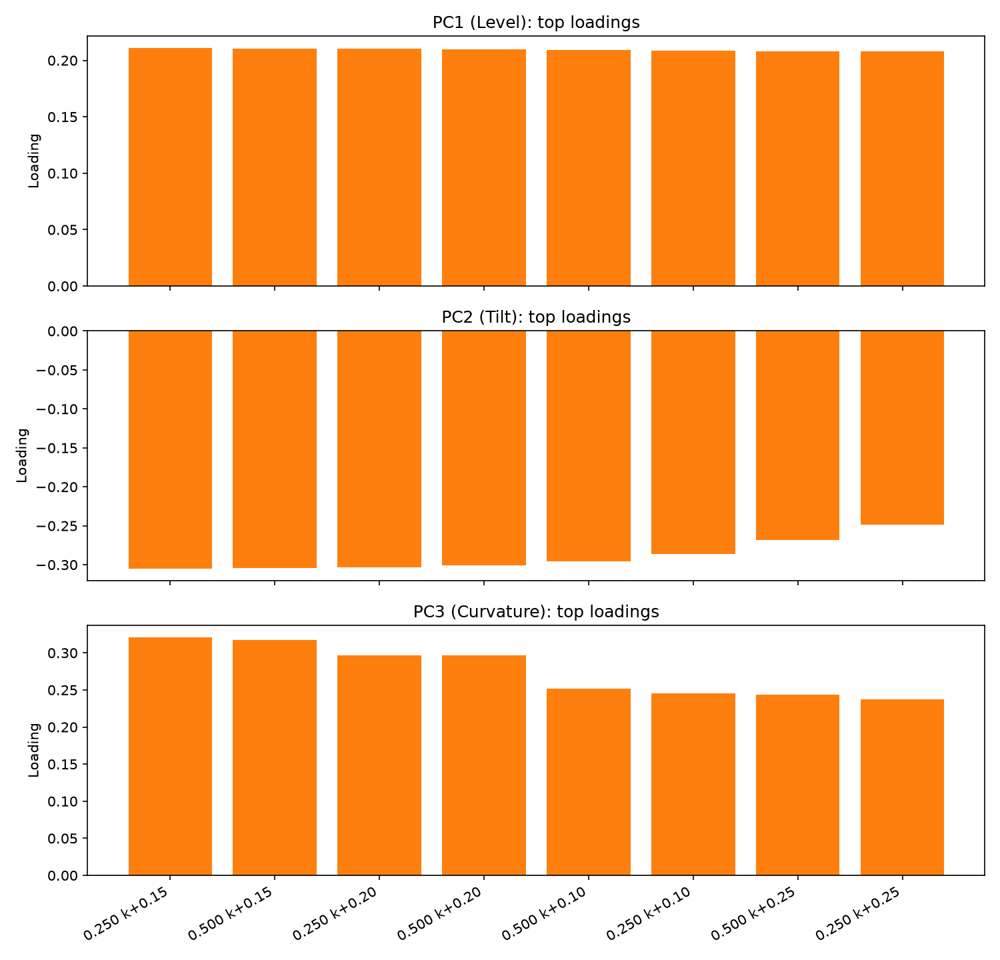
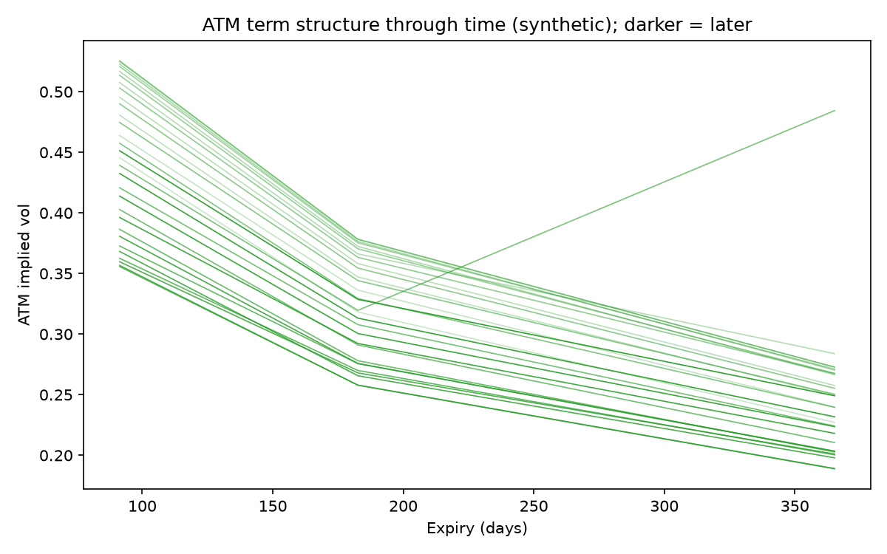

# arbfree-vol-surface

Turns a messy option chain into a clean implied vol surface that won't blow up exotic pricers. You give it raw quotes and it hands back a calibrated surface you can query for IV, Greeks, local vol, and PCA modes. The slices fit with hard-constrained eSSVI satisfy the Gatheral–Jacquier conditions and a grid-based calendar check. Slices that fall back to an unconstrained per-slice fit are not arbitrage-free; they get flagged in `RepairReport.fallback_slices` / `repair_infeasible` rather than passed off as clean.

## Why this exists

An implied vol surface is what the market charges for convexity at every strike and expiry. Exotic desks, risk systems, and basically anyone pricing something off vol depends on it being sane.

Raw quotes are garbage though. Bid/ask gaps, stale prints, crossed markets, strikes nobody trades. Fit a surface straight to that mess and you'll violate put-call parity, monotonicity, butterfly, calendar, all the basic no-arb conditions. This library cleans the data, finds the violations, and fits a smooth model in one pass.

## What it actually does

Five steps:

1. Clean the quotes. Eight rules drop bad prices, crossed markets, wide spreads, and near-expiry contracts. There's also a pre-ingestion liquidity filter (`data/quality.py`) that removes low-open-interest and wide-spread strikes. Every rejected quote is kept with a reason, so you can see what got thrown out and why.
2. Detect arbitrage. Five static checks: put-call parity, strike monotonicity, butterfly (convexity), calendar, and wide-spread.
3. Repair. Reject the offending quotes, estimate a forward per expiry from the median of the put-call parity pairs, then refit a smile model with a penalty pushing against arbitrage during calibration.
4. Query. The fitted surface gives you `iv_at(strike, expiry)` and portfolio Greeks (delta, gamma, vega, theta, rho).
5. Build on it. Downstream modules pull Dupire local vol and run PCA over a time series of surfaces to find the dominant ways the surface moves.

Three smile models: raw SVI (Gatheral 2004), eSSVI (Gatheral–Jacquier 2014), and SABR (Hagan 2002). All three convert to a common SVI parameterization, so the rest of the pipeline doesn't care which you used.

## Quick start

```bash
pip install -e .                                              # installs `arbfree` CLI
arbfree --help                                                # repair | detect | price | fetch
pytest tests/ -q                                              # full test suite
python demo/yfinance/yfinance_demo.py                         # live SPY pipeline, 6 plots (needs network; --offline for synthetic)
python demo/ticker_compare/ticker_compare.py                  # cross-ticker SVI/eSSVI/SABR, 3 plots (SPY/QQQ/IWM; --offline available)
python demo/dynamics_pca/dynamics_pca.py                      # PCA over a surface time series, 3 plots (synthetic by default)
python demo/cli/cli_demo.py                                   # walk through `arbfree detect/repair/price` on a generated CSV
```

### CLI

```bash
# CSV -> arb-free surface (DayCount + FRED curve are opt-in)
arbfree repair chain.csv --spot 450 --as-of 2026-05-18 --day-count ACT/365F --calendar USNYSE --use-fred-curve -o report.json
arbfree repair chain.csv --spot 450 --use-ssvi --offline       # FRED offline falls back to flat r=0.05
arbfree detect chain.csv --spot 450 --no-forward               # quote-level violations without forward pre-pass
arbfree price --spot 100 --strike 100 --expiry 0.25 --vol 0.2  # price; add --put for puts
arbfree price --spot 100 --strike 100 --expiry 0.25 --price 4.61  # invert -> IV
arbfree price --spot 100 --strike 100 --expiry-date 2026-12-18 --as-of 2026-05-18 --day-count ACT/360 --vol 0.2
arbfree fetch --symbol SPY --max-expiries 5 --use-fred-curve --repair --use-ssvi  # live yfinance
```

CSV rows need `strike,expiry,option_type,price` and (for the cleaning layer
to pass) `bid,ask` — the CLI demo writes one you can crib from.

`config.yaml` in the repo root supplies defaults (`day_count`, `calendar`, `risk_free`, `div_yield`, `use_fred_curve`); every CLI flag overrides the file. Requires `pyyaml` only when a config file is present.

## Demos

Four demo scripts cover the toolkit end to end. All of the data-driven ones
accept `--offline` for a deterministic synthetic run (no network); live mode
uses yfinance.

### 1. Single-ticker pipeline (`demo/yfinance/`)

`python demo/yfinance/yfinance_demo.py` pulls live SPY options, repairs them
with all three models, interpolates the surface, extracts Dupire local vol,
computes Greeks, and writes six plots. It also exercises the modern ingestion
seams: FRED `YieldTermStructure` for per-slice `r(T)`, `ACT/365F` day count,
and the USNYSE calendar roll.







eSSVI slices that fall back to an unconstrained fit (H&M hard constraints
couldn't be satisfied) are grayed out in the IV / Dupire / Greeks heatmaps and
listed in the console output.

### 2. Cross-ticker comparison (`demo/ticker_compare/`)

`python demo/ticker_compare/ticker_compare.py` fetches several chains
(SPY/QQQ/IWM by default) and compares the three models across tickers:
ATM term structure, a ~30-day smile overlay, and median fit RMSE per model
(median, not mean, so a couple of noisy expiries can't dominate).







### 3. Surface dynamics via PCA (`demo/dynamics_pca/`)

`python demo/dynamics_pca/dynamics_pca.py` fits a time series of surfaces,
stacks the fitted SVI parameters into a matrix, and runs SVD-based PCA to find
the dominant deformation modes (Level / Tilt / Curvature). It runs on a
deterministic synthetic time series (no network) — collecting real daily
snapshots is a roadmap item.







### 4. CLI walkthrough (`demo/cli/`)

`python demo/cli/cli_demo.py` generates a small synthetic chain CSV and runs
`arbfree detect`, `repair`, and `price` against it, printing what each command
does. No network, no setup — the fastest way to see the toolkit work.

## How the modules fit

- `models/` typed boundary objects: `OptionContract`, `Quote`, `ExpirySlice`, `VolSurface`.
- `pricing/` Black-Scholes pricing, analytic Greeks, the implied-vol solver (Newton with a Brent fallback), and Dupire local vol.
- `time/` `DayCount` (`ACT/365F` default = `days/365.0`, `ACT/360`, `30/360`) and `Calendar` (`USNYSE` with NYSE holidays, `adjust(following|preceding|modified_following)`).
- `rates/` `YieldTermStructure` (pillars `T,r` linear on `r`, flat extrap., `discount`/`forward_rate`, `from_callable` for QuantLib) and `fred.py` FRED `SOFR`+`DGS` Treasury curve with disk cache.
- `ingestion/` Yahoo Finance fetcher (real risk-free rates / optional FRED `r(T)`), a CSV loader, and the eight-rule cleaning layer. All `fetch_chain`/`load_chain_csv` accept `day_count`, `calendar`, `curve`/`use_fred_curve`.
- `arbitrage/` the static-arbitrage detectors, at the quote level and on the fitted SVI curves.
- `svi/`, `ssvi/`, `sabr/` the three smile models and their calibrators.
- `repair/` the orchestrator that cleans, detects, fits, and re-validates.
- `surface/` the query layer: `iv_at` and portfolio Greeks.
- `dynamics.py` SVD-based PCA over a surface time series (no sklearn).
- `viz/` the matplotlib plots.
- `cli.py` + `config.yaml` — `arbfree` CLI (`repair`/`detect`/`price`/`fetch`) with YAML defaults; flags override file.

## Design notes

A few things baked into the code that are worth knowing:

- Pydantic at the edges, dataclasses inside. Inputs and outputs are validated Pydantic models. The hot path (Greeks, violations, fitted slices) uses frozen `@dataclass`. No Pydantic in the numerical loops.
- Detection reports every violation in one pass instead of throwing on the first. Repair tells you what it couldn't fix instead of pretending it did.
- The per-expiry forward is the median of the strike-level put-call parity estimates, not the mean, so a single bad quote can't yank it around.
- Constrained calibration. The raw-SVI objective adds a penalty for butterfly violations (eSSVI uses hard constraints, SABR a calendar soft penalty), so the fit gets steered away from impossible shapes instead of minimized blind.
- Pluggable models. `repair(use_ssvi=..., use_sabr=...)` swaps the model, and `to_raw_svi_params()` keeps everything downstream unchanged.

## Status

The core engine is built and tested: ingestion, cleaning, the five arbitrage checks, three smile models, repair, the query layer, Dupire, PCA, `DayCount`/`Calendar`, and `YieldTermStructure` with FRED `SOFR`+`DGS` Treasury curve. The test suite covers known-value cases, IV round-trips, synthetic violation injection, and calibration recovery, and it grows with the codebase.

It's not a production service. No REST API, no database, no dashboard but it does have a real CLI (`arbfree repair|detect|price|fetch`, see above) with `config.yaml` defaults, term-structure `r(T)` per slice, and selectable day-count/calendar. Plots are static PNGs. The raw-SVI path is not arbitrage-free by construction; eSSVI is, but only in the sense that slices fitting within the H&M hard constraints and passing the grid-based calendar check get certified, while fallback slices get surfaced through `RepairReport.fallback_slices` / `repair_infeasible`. SABR is fit as a comparison model, not an arb-free construction, so its residuals are reported rather than eliminated. Demonstrated on a handful of US equities and ETFs (SPY default; QQQ, AAPL, MSFT, NVDA via `--symbol`). European options only.

## Roadmap

`docs/roadmap.md` has the details. PCA dynamics, SABR, Dupire local vol are done. The CLI (incl. DayCount/Calendar + FRED term-structure wire-through) is done. FastAPI + DuckDB storage and a Streamlit dashboard are next.

## Tech stack

Python 3.11+, NumPy, SciPy, Pydantic, Pytest. No sklearn (PCA uses `numpy.linalg.svd`). No web framework yet.

## References

- Gatheral, *The Volatility Surface: A Practitioner's Guide* (SVI, 2004)
- Gatheral and Jacquier, *Arbitrage-free SVI volatility surfaces* (2014)
- Hagan et al., *Managing Smile Risk* (SABR, 2002)
- Dupire, *Pricing with a Smile* (local volatility)
