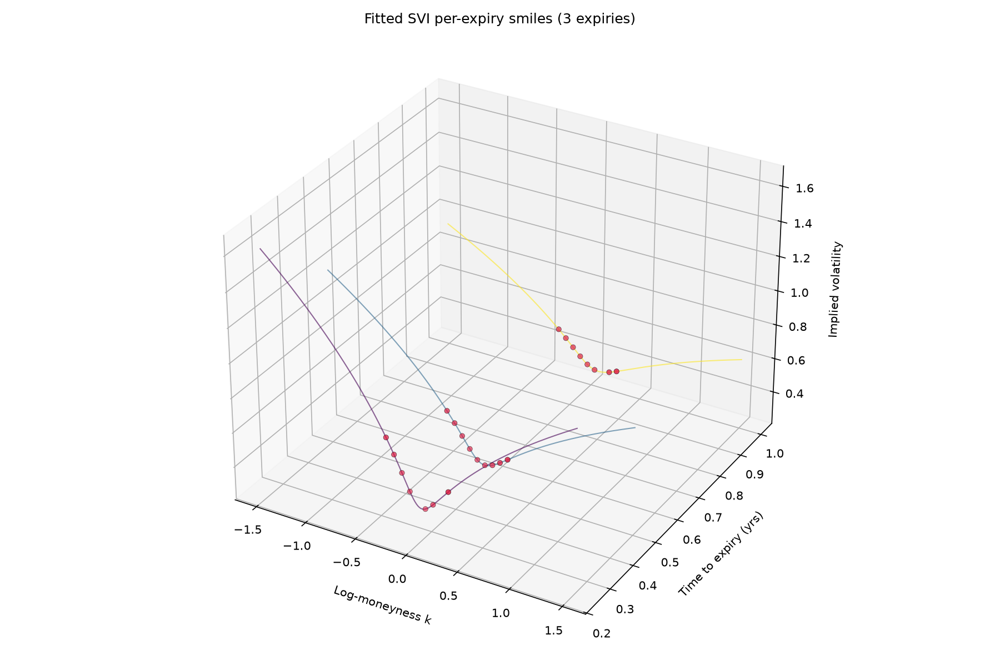
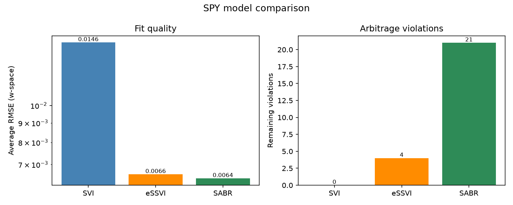
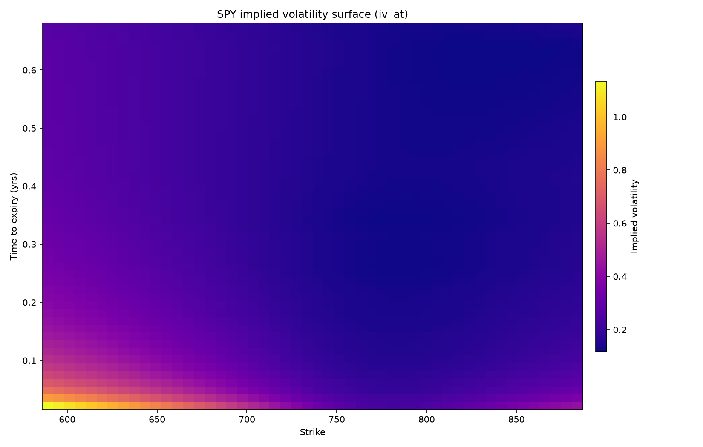
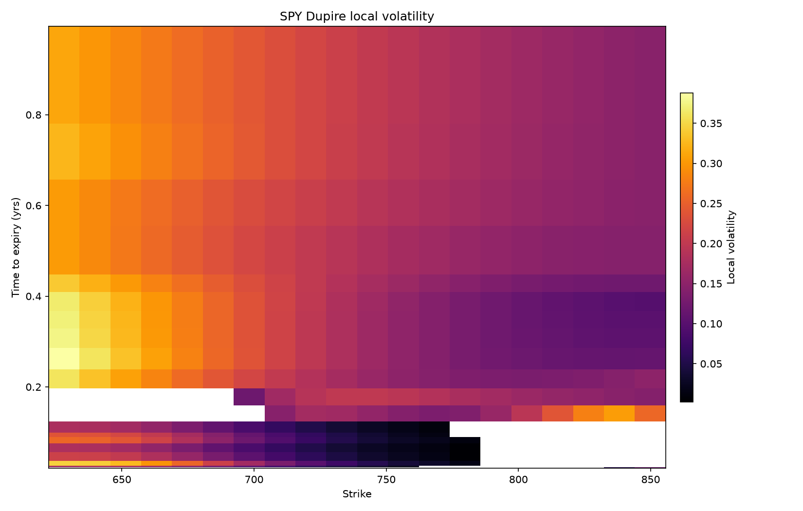
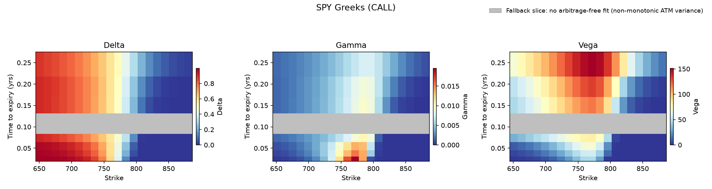
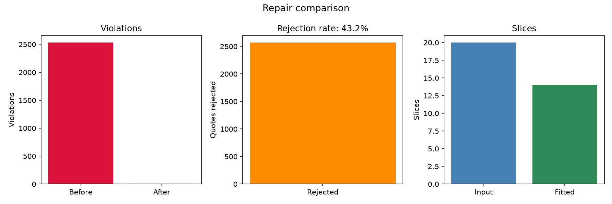

# arbfree-vol-surface

A library that turns a messy option chain into a clean, arbitrage-aware implied volatility surface. Feed it raw quotes; get back a calibrated surface you can query for IV, Greeks, local vol, and PCA modes. Hard-constrained eSSVI slices are arbitrage-free by construction; slices that fall back to an unconstrained per-slice fit are not, and the repair report says so (`RepairReport.fallback_slices` / `repair_infeasible`).

## The problem

An implied vol surface is what the market is charging for convexity at every strike and every expiry. Exotic pricers, risk systems, and vol desks all lean on it.

Raw option quotes are noisy: bid/ask gaps, stale prints, crossed markets, illiquid strikes. Fit a surface straight to those quotes and it will break basic no-arbitrage conditions — put-call parity, monotonicity, butterfly, calendar, wide-spread. Before the surface is usable, someone has to clean the data, find the violations, and fit a smooth model. This project does all of that in one pipeline.

## What it does

Five stages:

1. **Clean the quotes.** Eight cleaning rules drop bad prices, crossed markets, wide spreads, and near-expiry options. A separate pre-ingestion liquidity filter (`data/quality.py`) removes low-open-interest / wide-spread strikes. Every rejected quote is kept with a reason, so you can see why it was dropped.
2. **Detect arbitrage.** Five classic static-arbitrage checks: put-call parity, strike monotonicity, butterfly (convexity), calendar, and wide-spread.
3. **Repair the surface.** Reject the offending quotes, estimate a forward price per expiry from the median of put-call parity pairs, then refit a smile model with a penalty term that pushes against arbitrage during calibration.
4. **Query it.** The fitted surface answers `iv_at(strike, expiry)` and aggregates portfolio Greeks (delta, gamma, vega, theta, rho).
5. **Build on it.** Downstream modules extract Dupire local vol and run PCA on a time series of surfaces to find the dominant ways the surface moves.

Three smile models are supported: raw SVI (Gatheral 2004), eSSVI (Gatheral-Jacquier 2014), and SABR (Hagan 2002). All three map back to a common SVI parameterization, so everything downstream works the same regardless of which you pick.

## Quick start

```bash
pytest tests/ -q                                              # full test suite (currently 439 tests + 2 expected XPASS tripwires; grows with the suite)
python demo/full_pipeline_demo.py                             # full pipeline on synthetic data (no network)
python demo/yfinance/yfinance_demo.py                         # live demo, 7 plots (needs network; use --symbol TICKER for others)
python demo/ticker_compare/ticker_compare.py                  # live cross-ticker comparison, 3 plots (SPY/QQQ/IWM by default)
```

## Live showcase (SPY options)

Run `python demo/yfinance/yfinance_demo.py --symbol SPY` to pull live SPY options, repair them with all three smile models, interpolate the fitted surface, extract Dupire local vol, compute portfolio Greeks, and produce the seven plots below.

### 3D implied volatility surface



### Smile model comparison (SVI / eSSVI / SABR)


### Model fit quality comparison



### Implied vol heatmap (via iv_at)



### Dupire local volatility



### Portfolio Greeks (delta / gamma / vega)



### Repair comparison (before vs after)



## How the modules fit

- `models/` — typed boundary objects: `OptionContract`, `Quote`, `ExpirySlice`, `VolSurface`.
- `pricing/` — Black-Scholes pricing, analytic Greeks, the implied-vol solver (Newton with a Brent fallback), and Dupire local vol.
- `ingestion/` — Yahoo Finance fetcher (with real risk-free rates), a CSV loader, and the eight-rule cleaning layer.
- `arbitrage/` — the static-arbitrage detectors, at the quote level and on the fitted SVI curves.
- `svi/`, `ssvi/`, `sabr/` — the three smile models and their calibrators.
- `repair/` — the orchestrator that cleans, detects, fits, and re-validates.
- `surface/` — the fitted-surface query layer: `iv_at` and portfolio Greeks.
- `dynamics.py` — SVD-based PCA on a time series of surfaces (no sklearn).
- `viz/` — all the matplotlib plots.

## Design conventions

A few decisions are baked into the code:

- **Pydantic at the edges, dataclasses inside.** Input and output types are validated Pydantic models. Everything in the hot path (Greeks, violations, fitted slices) is a frozen `@dataclass`. No Pydantic in the numerical loops.
- **Report, don't raise.** Detection lists every violation in one pass instead of throwing on the first. Repair tells you what it couldn't fix instead of pretending it fixed everything.
- **Median forward curve.** The per-expiry forward is the median of strike-level put-call parity estimates, not the mean, so one bad quote can't drag it around.
- **Constrained calibration.** The raw-SVI fit objective adds a penalty for butterfly-arbitrage violations (eSSVI uses hard constraints; SABR uses a calendar soft penalty), so the model is steered away from impossible shapes instead of minimized blindly.
- **Pluggable smile models.** `repair(use_ssvi=..., use_sabr=...)` switches models, and a `to_raw_svi_params()` adapter keeps the rest of the pipeline unchanged.

## What's done, and what isn't

The core engine is built and tested: ingestion, cleaning, the five static-arbitrage checks, three smile models, the repair loop, the query layer, Dupire, and PCA. The test suite covers known-value cases, IV round-trips, synthetic violation injection, and calibration recovery — currently 439 tests pass plus 2 expected XPASS tripwires (the m66 boundary tripwires), and the suite grows with the codebase.

This is not a production service yet. There's no CLI, no REST API, no database, and no dashboard. Visualization is static PNGs. The raw-SVI path is not arbitrage-free by construction; the eSSVI path is, but only for slices that fit within the H&M hard constraints — slices that fall back to an unconstrained per-slice fit are surfaced via `RepairReport.fallback_slices` / `repair_infeasible` rather than certified. SABR is fit as a comparison model, not as an arb-free construction, so its residuals are reported rather than eliminated. And it's demonstrated on a handful of US equities and ETFs (SPY by default; QQQ, AAPL, MSFT, NVDA also work via `--symbol`). See `demo/ticker_compare/` for a side-by-side comparison across multiple tickers. European options only.

## Roadmap

`docs/roadmap.md` has the details. PCA dynamics, SABR, and Dupire local vol are done. A CLI, FastAPI + DuckDB storage, and a Streamlit dashboard are next.

## Tech stack

Python 3.11+, NumPy, SciPy, Pydantic, Pytest. No sklearn (PCA uses `numpy.linalg.svd`). No web framework yet.

## References

- Gatheral, *The Volatility Surface: A Practitioner's Guide* (SVI, 2004)
- Gatheral and Jacquier, *Arbitrage-free SVI volatility surfaces* (2014)
- Hagan et al., *Managing Smile Risk* (SABR, 2002)
- Dupire, *Pricing with a Smile* (local volatility)
