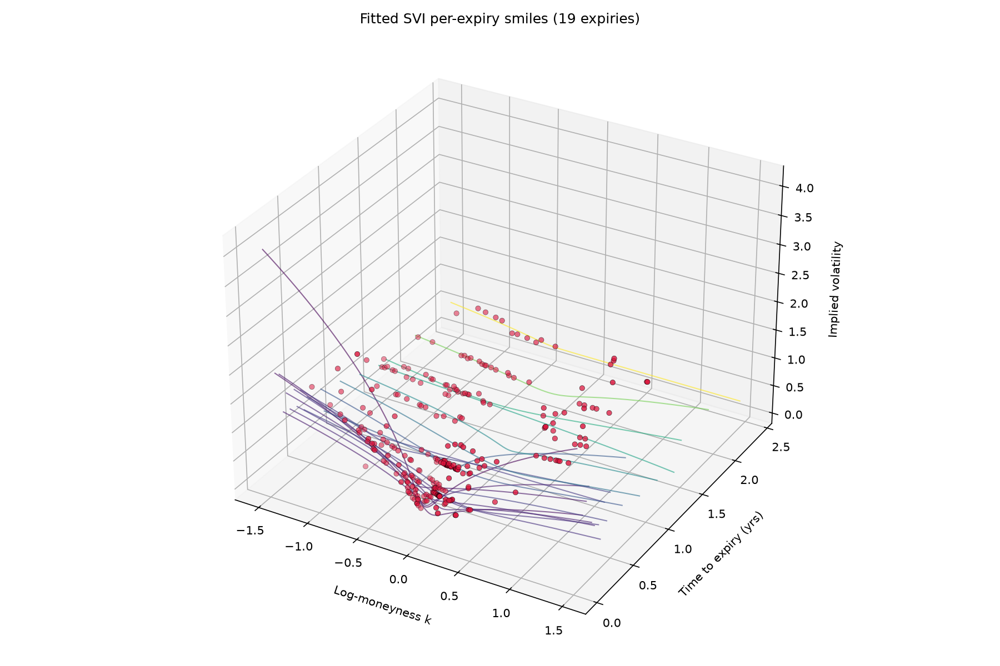
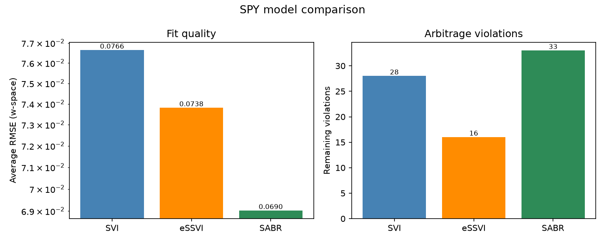
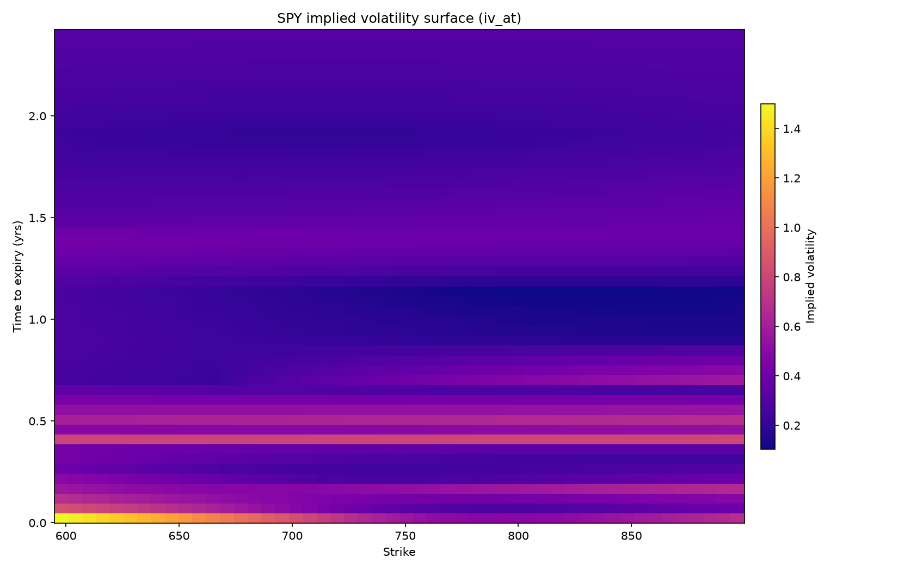
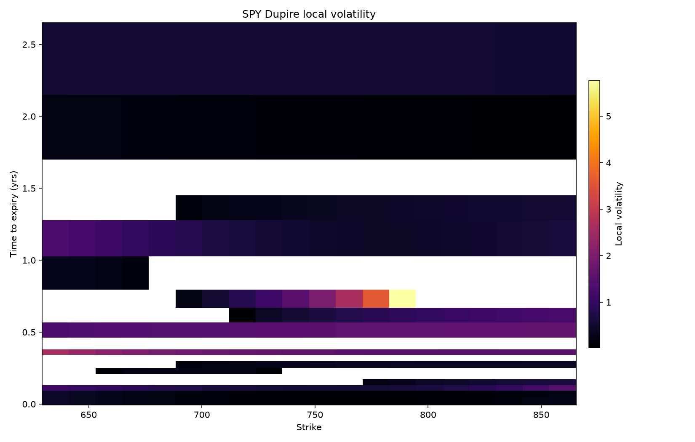
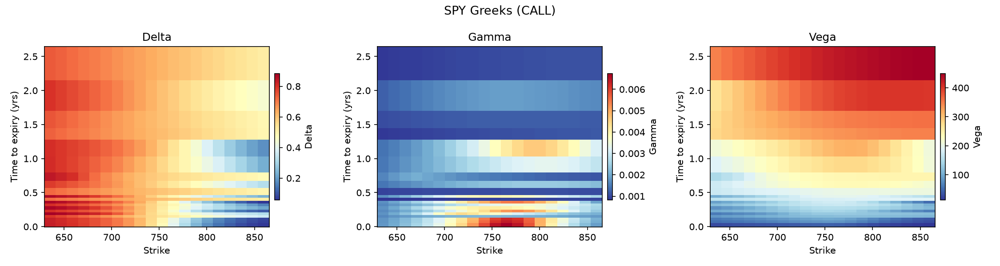
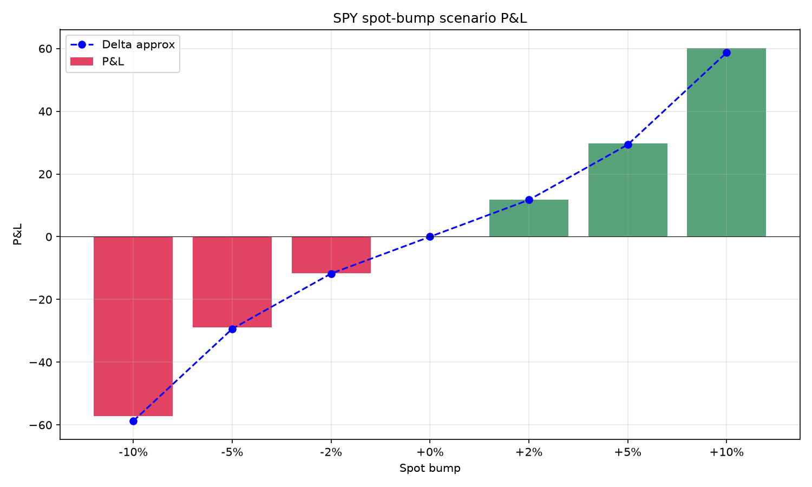
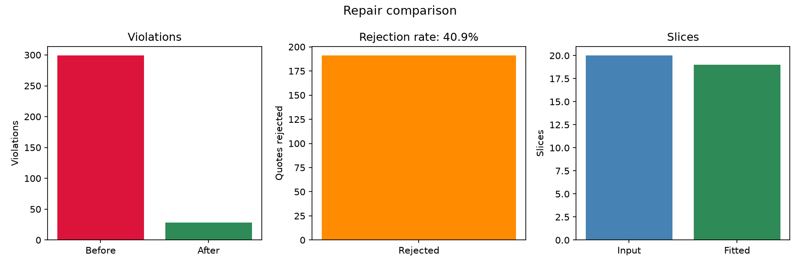

# arbfree-vol-surface

A Python library that turns a noisy real-world option chain into a clean,
arbitrage-free implied volatility surface — the thing a real vol desk
actually prices and risks off.

## The problem

An implied volatility surface tells you, for every strike and every
expiry, the volatility the market is charging. Every exotic pricer,
every risk report, and every volatility trade depends on it.

You can't just read it off the market. Raw option quotes are full of
bid/ask noise, stale prints, crossed markets, and illiquid strikes, and
the surface you'd get back routinely violates basic no-arbitrage
conditions — the kind that would let someone lock in a risk-free profit
if they were real. A desk has to clean the data, find the violations,
and fit a smooth model before the surface is usable. This project does
that end to end.

## What it does

The pipeline runs in five stages:

1. **Clean the quotes.** Eight rejection rules strip out bad prices,
   crossed markets, wide spreads, illiquid contracts, and near-expiry
   options. Every rejected quote is kept with a reason, so you can audit
   why it was dropped.
2. **Detect arbitrage.** Checks the four classical static-arbitrage
   conditions: put-call parity, strike monotonicity, butterfly
   (convexity) arbitrage, and calendar arbitrage (total variance has to
   rise with maturity).
3. **Repair the surface.** Rejects the worst offending quotes, estimates
   a forward price per expiry from the median of put-call parity pairs,
   then refits a smile model with a penalty term that actively
   discourages arbitrage during calibration.
4. **Query it.** The fitted surface answers `iv_at(strike, expiry)`,
   aggregates portfolio Greeks (delta, gamma, vega, theta, rho), and
   runs spot- and vol-bump scenario analysis.
5. **Build on it.** Downstream modules strip out Dupire local
   volatility, run PCA on a time-series of surfaces to find the dominant
   ways the surface moves, and backtest a cross-sectional mispricing
   signal.

Three smile models are supported — raw SVI (Gatheral 2004), eSSVI
(Gatheral-Jacquier 2014), and SABR (Hagan 2002). All three map back to
a common SVI parameterization, so everything downstream works the same
no matter which you pick.

## Quick start

```bash
pytest tests/ -q                              # 191 tests across 24 files
python demo/full_pipeline_demo.py             # full pipeline on synthetic data (no network)
python examples/yfinance_demo.py              # live SPY demo, 8 plots (needs network)
python examples/backtest_demo.py              # live SPY mispricing backtest
```

## Live showcase (SPY options)

Run `python examples/yfinance_demo.py` to pull live SPY options, repair
them with all three smile models, interpolate the fitted surface,
extract Dupire local vol, compute portfolio Greeks, run spot-bump
scenarios, and produce the eight plots below.

### 3D implied volatility surface



### Smile model comparison (SVI / eSSVI / SABR)


### Model fit quality comparison



### Implied vol heatmap (via iv_at)



### Dupire local volatility



### Portfolio Greeks (delta / gamma / vega)



### Spot-bump scenario P&L



### Repair comparison (before vs after)



## How the modules fit

- **`models/`** — typed boundary objects: `OptionContract`, `Quote`,
  `ExpirySlice`, `VolSurface`.
- **`pricing/`** — Black-Scholes pricing, analytic Greeks, the
  implied-vol solver (Newton with a Brent fallback), and Dupire local
  vol.
- **`ingestion/`** — a Yahoo Finance fetcher (with real risk-free
  rates), a CSV loader, and the eight-rule cleaning layer.
- **`arbitrage/`** — the static-arbitrage detectors, both at the quote
  level and on the fitted SVI curves.
- **`svi/`, `ssvi/`, `sabr/`** — the three smile models and their
  calibrators.
- **`repair/`** — the orchestrator that cleans, detects, fits, and
  re-validates.
- **`surface/`** — the fitted-surface query layer: `iv_at`, portfolio
  Greeks, scenarios.
- **`dynamics.py`** — SVD-based PCA on a time-series of surfaces (no
  sklearn).
- **`backtest/`** — the cross-sectional mispricing backtest.
- **`viz/`** — all the matplotlib plots.

## Where this fits

This repo is the surface engine that the companion
`vol-derivatives-pricer` project builds on. That project consumes the
calibrated surface to price
variance swaps, vol swaps, and structured notes (range accruals, shark
fins). The surface problem and the pricing problem are kept in separate
repos on purpose — calibration is hard enough on its own.

## Design conventions

A few choices shaped the code, and they're worth knowing if you read it:

- **Pydantic at the edges, dataclasses inside.** Input and output types
  are validated Pydantic models; everything in the hot path (Greeks,
  violations, fitted slices) is a frozen `@dataclass`. No Pydantic in
  the numerical loops.
- **Report, don't raise.** Detection lists every violation in one pass
  rather than throwing on the first. Repair tells you what it couldn't
  fix instead of pretending it fixed everything.
- **Median forward curve.** The per-expiry forward is the median of
  strike-level put-call parity estimates, not the mean — one bad quote
  can't drag it.
- **Constrained calibration.** The fit objective includes a penalty for
  butterfly-arbitrage violations, so the model is nudged away from
  impossible shapes rather than blindly minimized.
- **Pluggable smile models.** `repair(use_ssvi=..., use_sabr=...)`
  switches models; a `to_raw_svi_params()` adapter keeps the rest of the
  pipeline unchanged.

## What's done, and what isn't

The core engine is built and tested: ingestion, cleaning, all four
arbitrage checks, three smile models, the repair loop, the query layer,
Dupire, PCA, and a single-snapshot mispricing backtest. The test suite
covers known-value cases, IV round-trips, synthetic violation
injection, and calibration recovery.

It is not, yet, a production service. There's no CLI, no REST API, no
database, and no dashboard — visualization is static PNGs. The backtest
is single-snapshot with a frozen-vol hedge, not a rolling daily-refit
(that needs a historical snapshot collector that doesn't exist yet).
SABR is fit but not arbitrage-free by construction, so its residuals are
reported rather than eliminated. And it's demonstrated on SPY only, with
European options only.

## Roadmap

See `docs/roadmap.md`. Completed: PCA dynamics, SABR, Dupire local vol,
and the mispricing backtest. Next up: a CLI, FastAPI + DuckDB storage, a
Streamlit dashboard, and a rolling daily-refit backtest.

## Tech stack

Python 3.12+, NumPy, SciPy, Pydantic, Pytest. No sklearn — PCA is done
with `numpy.linalg.svd`. No web framework yet.

## References

- Gatheral — *The Volatility Surface: A Practitioner's Guide* (SVI, 2004)
- Gatheral & Jacquier — *Arbitrage-free SVI volatility surfaces* (2014)
- Hagan et al. — *Managing Smile Risk* (SABR, 2002)
- Dupire — *Pricing with a Smile* (local volatility)
